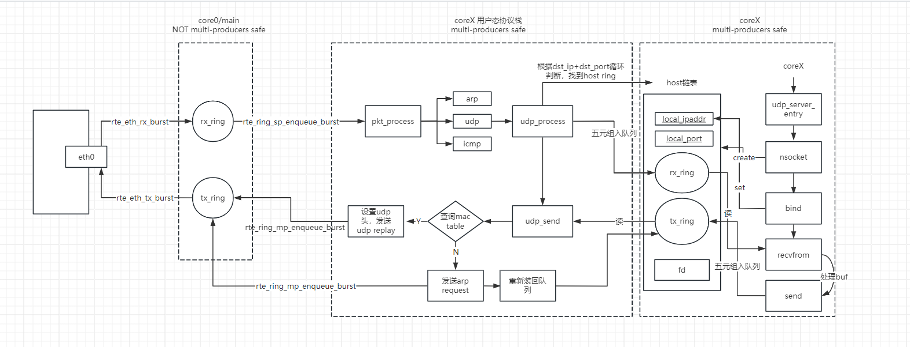

#### pthread_cond_signal 用法
  在调用 pthread_cond_wait 之前，线程必须首先获取互斥锁。之后线程会进入阻塞状态，并会自动释放线程当前持有的互斥锁mutex，等待条件变量发出信号。这段时间内，线程不会继续执行，直到条件变量被其他线程发出信号。一旦条件变量被信号激活，线程会被唤醒，但它不会立即继续执行，而是首先重新获取互斥锁。只有在成功获取到锁之后，线程才能继续执行接下来的操作。

#### 队列的几种类型
 
 - rte_ring_mp_enqueue 和 rte_ring_mp_enqueue_burst 是 DPDK（Data Plane Development Kit）中的两个函数，用于在环形缓冲区（ring buffer）中进行入队操作。它们的主要区别在于单个入队操作与批量入队操作的实现。
    - rte_ring_mp_enqueue(struct rte_ring *r, void *obj) 接收的是obj 指针类型
    - rte_ring_mp_enqueue_burst(struct rte_ring *r, void * const *obj_table,unsigned int n, unsigned int *free_space) 接收的是obj 指针的指针类型
 - 命名规则：
    - rte_ring_m* 表示 multi-producers safe;
    - rte_ring_s* 表示 single NOT multi-producers safe;
    - rte_ring_mc_dequeue 表示 customer 出队列;
    - rte_ring_mp_enqueue 表示 productor 入队列

#### 参数没有使用减少warn
 使用 __attribute__((unused)) 修饰 如：__attribute__((unused)) int unused
### inline关键字
  当一个函数被标记为 inline，编译器会尝试将函数的代码直接嵌入到调用该函数的代码中，而不是生成一个标准的函数调用指令。这可以减少函数调用的开销，如栈操作和跳转指令，参数传递、栈帧的创建和销毁等，尤其对于短小且频繁调用的函数。
  
  虽然内联函数可以提高性能，但它也可能导致代码尺寸的增加。如果函数体很大或者被大量内联，可能会导致代码膨胀，从而影响缓存命中率和整体性能。

#### 架构图

